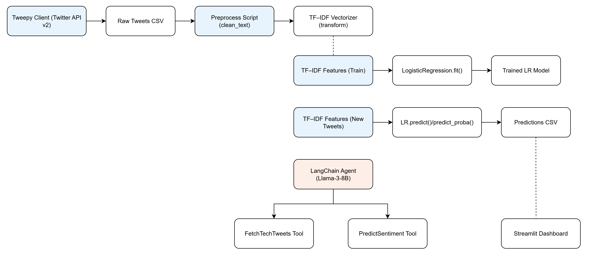
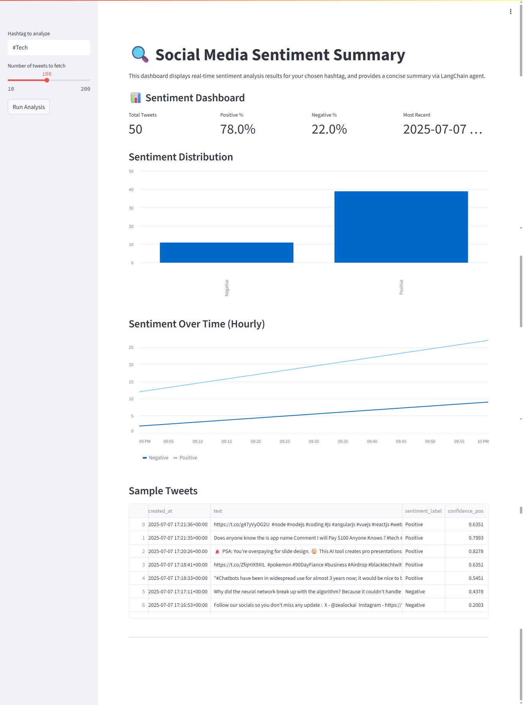

# 🔍 Social Media Sentiment Analysis

A LangChain-driven pipeline that fetches live tweets (e.g. `#Tech`), cleans & vectorizes them, trains/evaluates a Logistic Regression classifier, and delivers real-time sentiment insights via an interactive dashboard.

---

## 📖 Table of Contents

1. [Overview](#-overview)  
2. [Features](#-features)  
3. [Architecture](#-architecture)  
4. [Tech Stack](#-tech-stack)  
5. [Installation](#-installation)  
6. [Usage](#-usage)  
7. [Screenshots & Visuals](#-screenshots--visuals)  
8. [Contributing](#-contributing)  
9. [License](#-license)  
10. [Contact](#-contact)  

---

## 💡 Overview

This project enables personal-brand managers, creators, and developers to:

- **Ingest** real-time tweets using Tweepy or LangChain tools  
- **Clean** text (remove URLs, mentions, hashtags)  
- **Vectorize** via TF–IDF  
- **Train** & **evaluate** a Logistic Regression model on Sentiment140  
- **Orchestrate** steps with a LangChain agent powered by a local Llama-3-8B model  
- **Visualize** sentiment trends in a Streamlit dashboard :contentReference[oaicite:1]{index=1}  

---

## ⚙️ Features

- **Realtime Scraping**: Fetch tweets by hashtag  
- **Sentiment Classification**: 0 = Negative, 1 = Positive  
- **LangChain Agent**: ReAct loop for tool orchestration  
- **Streamlit Dashboard**:  
  - Key metrics (total tweets, % positive/negative, latest timestamp)  
  - Bar chart of sentiment distribution  
  - Line chart of sentiment over time (hourly)  
  - Sample tweets with full text, label & confidence  

---

## 🏗 Architecture

  
*Figure: End-to-end pipeline—from data ingestion to dashboard*}  

---

## 🏗 Screenshots & Visuals

  
*Figure: Streamlit Dashboard*}  

---

## 🛠 Tech Stack

| Layer               | Tools & Libraries                      |
|---------------------|----------------------------------------|
| **Data Ingestion**  | Tweepy, fetch_recent_tweets()          |
| **Preprocessing**   | Python, pandas, custom `clean_text`    |
| **Vectorization**   | scikit-learn `TfidfVectorizer`         |
| **Modeling**        | scikit-learn `LogisticRegression`      |
| **Agent Orchestration** | LangChain, meta-llama-3-8B         |
| **Dashboard**       | Streamlit                              |

---

## 🚀 Installation

1. **Clone the repo**  
   ```bash
   git clone https://github.com/<your-username>/social-media-sentiment.git
   cd social-media-sentiment
   python3 -m venv venv
   source venv/bin/activate
   pip install -r requirements.txt


